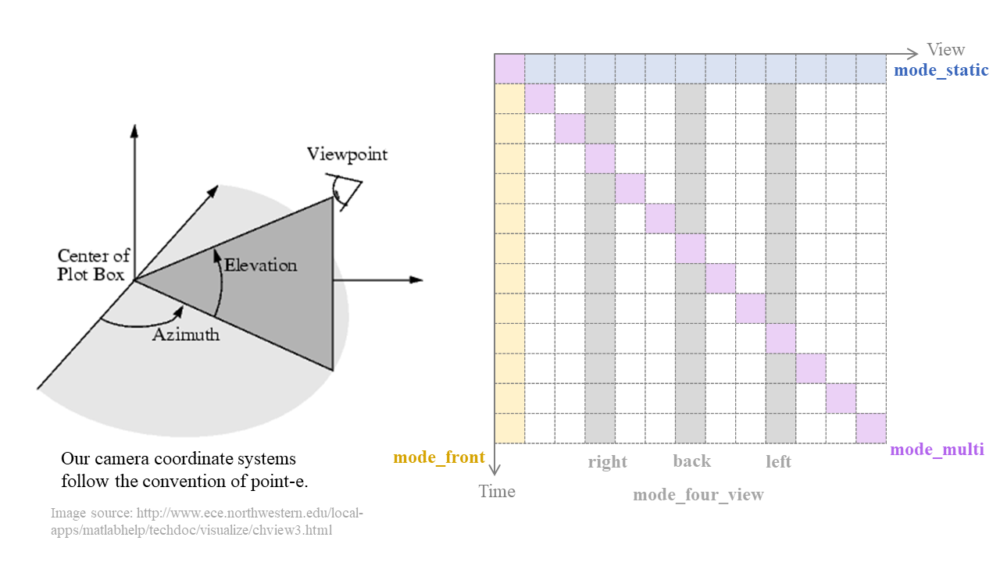

# Diffusion4D: Fast Spatial-temporal Consistent 4D Generation via Video Diffusion Models

The official implementation of work "Diffusion4D: Fast Spatial-temporal Consistent 4D Generation via Video Diffusion Models".

[[Project Page]](https://vita-group.github.io/Diffusion4D/) | [[Arxiv]](https://arxiv.org/abs/2405.16645) | [[Video (Youtube)]](https://www.youtube.com/watch?v=XJT-cMt_xVo) | [[视频 (Bilibili)]](https://b23.tv/ojVe6Uv) | [[Huggingface Dataset]](https://huggingface.co/datasets/hw-liang/Diffusion4D)

# Image-to-4D


# Text-to-4D

# 3D-to-4D


# News
- 2024.6.28:  Released rendered data from curated [objaverse-xl](https://huggingface.co/datasets/hw-liang/Diffusion4D/tree/main/objaverseXL_curated), including orbital videos of dynamic 3D and monocular videos from front view.
- 2024.6.4:  Released rendered data from curated [objaverse-1.0](https://huggingface.co/datasets/hw-liang/Diffusion4D/tree/main/objaverse1.0_curated), including orbital videos of dynamic 3D, orbital videos of static 3D, and monocular videos from front view.
- 2024.5.27:  Released metadata for objects and data preparation code!
- 2024.5.26:  Released on arxiv!


# 4D Dataset Preparation


We collect a large-scale, high-quality dynamic 3D(4D) dataset sourced from the vast 3D data corpus of [Objaverse-1.0](https://objaverse.allenai.org/objaverse-1.0/) and [Objaverse-XL](https://github.com/allenai/objaverse-xl). We apply a series of empirical rules to curate the source dataset. You can find more details in our [paper](https://arxiv.org/abs/2405.16645). In this part, we will release the selected 4D assets, including:
1. Curated high-quality 4D object ID.
2. A render script using Blender, providing optional settings to render your personalized data.
3. [Rendered objaverse-1.0 4D images](https://huggingface.co/datasets/hw-liang/Diffusion4D/tree/main/objaverse1.0_curated) and [Rendered objaverse-xl 4D images](https://huggingface.co/datasets/hw-liang/Diffusion4D/tree/main/objaverseXL_curated) by our team to save you GPU time. With 8 GPUs and a total of 16 threads, it took **5.5 days** to render the curated objaverse-1.0 dataset and about **30 days** for objaverse-xl dataset. 

### 4D Dataset ID/Metadata
We first collect 365k dynamic 3D assets from Objaverse-1.0 (42k) and Objaverse-xl (323k). Then we curate a high-quality subset to train our models. 

The uncurated 42k IDs of all the animated objects from objaverse-1.0 are in `rendering/src/ObjV1_all_animated.txt`. The curated ~11k IDs of the animated objects from objaverse-1.0 are in  `rendering/src/ObjV1_curated.txt`. 

Metadata of animated objects (323k) from objaverse-xl can be found in [huggingface](https://huggingface.co/datasets/hw-liang/Diffusion4D/blob/main/meta_xl_animation_tot.csv). We also release the metadata of all successfully rendered objects from [objaverse-xl's Github subset](https://huggingface.co/datasets/hw-liang/Diffusion4D/blob/main/meta_xl_tot.csv).

For text-to-4D generation, the captions are obtained from the work [Cap3D](https://huggingface.co/datasets/tiange/Cap3D). 

### 4D Dataset Rendering Script
1. Clone the repository and enter the rendering directory:

```bash
git clone https://github.com/VITA-Group/Diffusion4D.git && \
cd rendering
```

2. Download Blender:

```bash
wget https://download.blender.org/release/Blender3.2/blender-3.2.2-linux-x64.tar.xz && \
tar -xf blender-3.2.2-linux-x64.tar.xz && \
rm blender-3.2.2-linux-x64.tar.xz
```

3. Download 4D objects

```bash
pip install objaverse
python download.py --id_path src/sample.txt
```

Please change `objaverse._VERSIONED_PATH` in `download.py` to the path you prefer to store the glb files. By default, it will be downloaded to `obj_v1/`.

4. Render 4D images

```bash
python render.py --obj_path "./obj_v1/glbs" \
                --save_dir './output' \
                --gpu_num 8           \
                --frame_num 24        \
                --azimuth_aug  1      \
                --elevation_aug 0     \
                --resolution 256      \
                --mode_multi 1        \
                --mode_static 1       \
                --mode_front_view 0   \
                --mode_four_view 0
```

Script Explanation:
- `--obj_path` Downloaded object path in step 3. Keep the same as your 'BASE_PATH'.
- `--save_dir` Directory to save.
- `--gpu_num` GPU number for rendering.
- `--frame_num` Number of frames to render. E.g., 24 means render from 'time=0' to 'time=24' images. You can set more or fewer frames, but the motion stops at a certain timestep, which differs with each case. Therefore, we do not recommend setting a large number of frames.
- `--azimuth_aug`  If set to 1, use azimuth augmentation. Images will be rendered from a random azimuth. Otherwise, set to 0.
- `--elevation_aug` If set to 1, use elevation augmentation. Images will be rendered from a random elevation. Otherwise, set to 0.
- `--resolution`   Image resolution. We set 256*256. If you want higher resolution, you can set 512 or 1024.
- `--mode_multi` If set to 1, use multi-view render mode. Images will be rendered from at 'time 0,view 0' to 'time T, view T'. Otherwise, set to 0.
- `--mode_static` If set to 1, use multi-static-view render mode. Images will be rendered from at 'time 0,view 0' to 'time 0, view T'. Otherwise, set to 0.
- `--mode_front_view` If set to 1, use front view render mode. Images will be rendered from at 'time 0,view front' to 'time T, view front'. The front view will change with azimuth augmention. Otherwise, set to 0.
- `--mode_four_view` If set to 1, use four view render mode. Images will be rendered from at 'time 0,view front,left,right,back' to 'time T, view front,left,right,back'. Otherwise, set to 0.



Output Explanation:
```
├── output
│   | object1
│     ├── multi_frame0-23.png          #mode_multi outputs 
│     ├── multi0-23.json               #mode_multi cameras 
│
│     ├── multi_static_frame0-23.png   #mode_static outputs
│     ├── static0-23.json              #mode_static cameras 
│
│     # optional
│     ├── front_frame0-23.png                   #mode_front_view outputs
│     ├── front.json                            #mode_front_view cameras
│     ├── front/left/right/back_frame0-23.png   #mode_four_view outputs
│     ├── front/left/right/back.json            #mode_four_view cameras
│
│   | object2
│   ....
│   | object3
│   ....
```
Our rendering script is based on [point-e](https://github.com/openai/point-e/blob/main/point_e/evals/scripts/blender_script.py) and [Objaverse](https://github.com/allenai/objaverse-xl/blob/main/scripts/rendering/blender_script.py) rendering scripts. Thanks a lot to all the authors for sharing!


## Other codes will be released soon!

### Acknowledgement
This project is based on numerous outstanding research efforts and open-source contributions. We are deeply grateful to all the authors for their generosity in sharing their work!
- https://github.com/alibaba/VideoMV
- https://github.com/hustvl/4DGaussians
- https://github.com/graphdeco-inria/gaussian-splatting
- https://github.com/graphdeco-inria/diff-gaussian-rasterization
- https://objaverse.allenai.org/objaverse-1.0/
- https://github.com/allenai/objaverse-xl
- https://github.com/crockwell/Cap3D
- https://github.com/openai/point-e

### If you find this repository/work/dataset helpful in your research, please consider citing the paper and starring the repo ⭐.

```
@article{liang2024diffusion4d,
  title={Diffusion4D: Fast Spatial-temporal Consistent 4D Generation via Video Diffusion Models},
  author={Liang, Hanwen and Yin, Yuyang and Xu, Dejia and Liang, Hanxue and Wang, Zhangyang and Plataniotis, Konstantinos N and Zhao, Yao and Wei, Yunchao},
  journal={arXiv preprint arXiv:2405.16645},
  year={2024}
}
```

<!-- ## Star History

[](https://star-history.com/#VITA-Group/Diffusion4D&Date) -->
